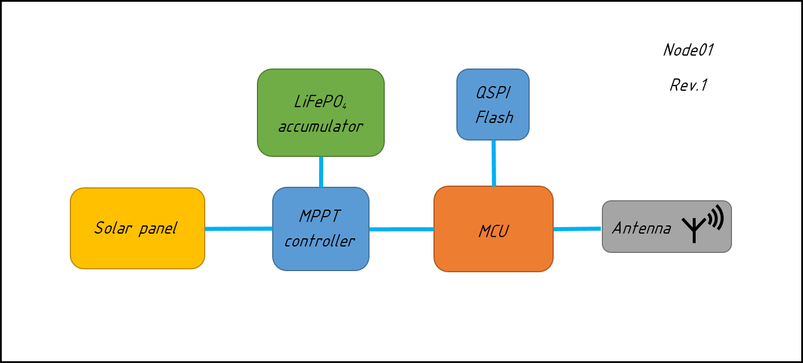
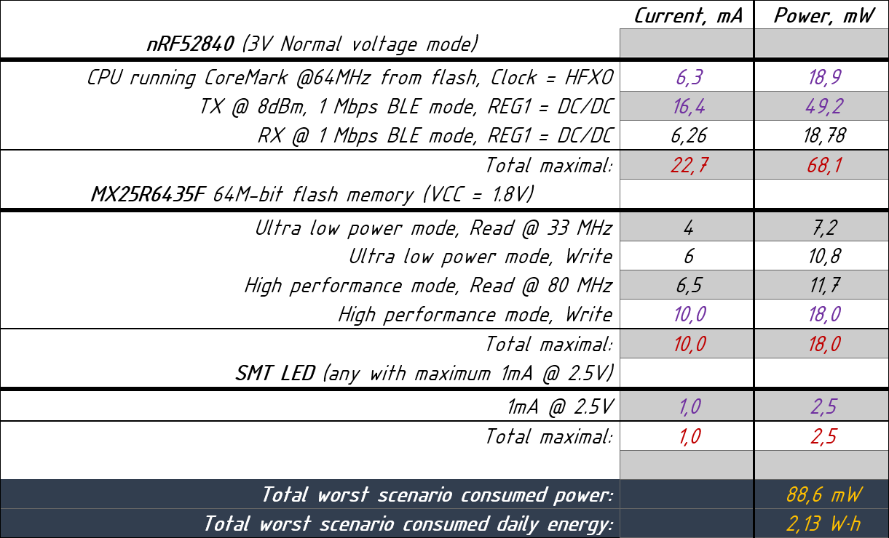

# Node01
Node01 is wireless mesh node. This node is the basis of backbone network.

###### Network example:

###### Node01 block scheme:

### Requirements
**Hardware**
* Based on Nordic Semiconductor IC (ex. nRF52840, ...)
* Continuous RF operation RX/TX
* Mostly static geo-position
* Autonomous power supply with a backup battery source
* Energy storage is supercap or LiFePO4(operates at low temperatures)
* Power connector for external solar panel or another energy source if available
* RF front end - range extender, switchable
* Switchable antenna to on-board or external SMA connector
* -40...+80 C deg outdoor temperature of operation
* minimum IP-63 protection
* Self monitor feature (integral temperature, battery lifetime monitoring)
* Flash storage IC
* UART interface
* 

**Software**
* Proprietary 2.4GHz protocol
* Operates as a router/switch
* Event based cooperative scheduler(in plans)
* Event-driven active object paradigm
* Or some of RTOS
* Modular hardware dependant part i.e. change in base board does not change
logic
of operation. Hardware are accessed throught API.
* C++ mixed with C and ASM for performance critical code sections(if possible)
* FOTA update
* Communication security: TBD !
* Minimal maintenance concept
* Self test feature
* Delay reliable communication
*

###### Power consumption analysis

###  Progress checklist
**Documentation**
- [ ] Technical specifications added.
- [ ] Power consumption analysis.
- [ ] Description.
- [ ] Hardware.
- [ ] Source.

**Hardware**
- [ ] Schematics designed.
- [ ] Simulations.
- [ ] PCB routed.
- [ ] Simulations.
- [ ] Rev. 1 manufactured.
- [ ] Rev. 1 tested.
- [ ] Changes to Rev. 1 made.
- [ ] Rev. 2 manufactured.
- [ ] Rev. 2 tested.
- [ ] Test passed.

**Software**
- [ ] Coding style guidleines added.
- [ ] Project guidlines added.
- [ ] Project organized.
- [ ] Build system created.
- [ ] Unit test system created.
- [ ] ... TBA
- [ ] MVP.
- [ ] Release of v.1.0.0

