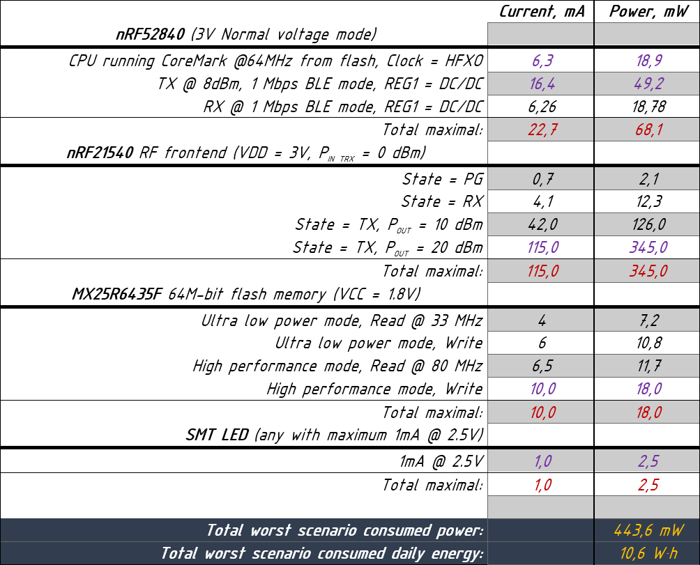
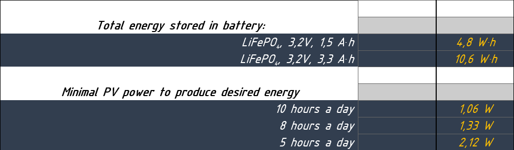

# Project logs
> The purpose of this is to write decisions and changes made to project.  

Put:  
* commit hash at the begining of discussion.
* And date.
* Also reporter name.  
---

###### Power consumption analysis.  

       Number: 1  
Project state: 4f51f26244daa80a04ce5664aafaebc53eb92157  
         Date: 18/03/2021  
     Reporter: Dmitry  
---

Problem:  
> Too high power consumption, too high energy storage, too high PV power.  
---

According to current setup, power consumption analysis showed that worst
scenario daily consumed energy is `10.6 W*h`.  
  
Which leads to LiFePO4 battery with `3.3 A*h` minimal capacity. Thus, to fully
charge up this battery in most optimistic scenario, 10 hour sunny day, `1.06 W`
PV panel is needed. Or `2.12 W` PV panel in 5 hour sunny day.  
  
---

Solution:  
> Exclude RF frontend. This will lower worst scenario power consumption by
`345 mW`.  
---
