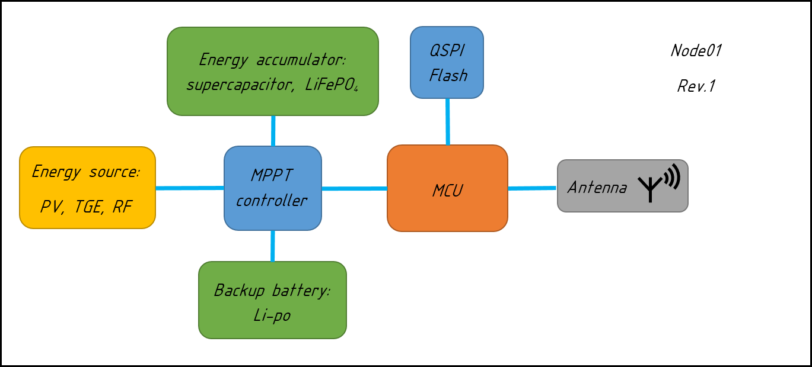
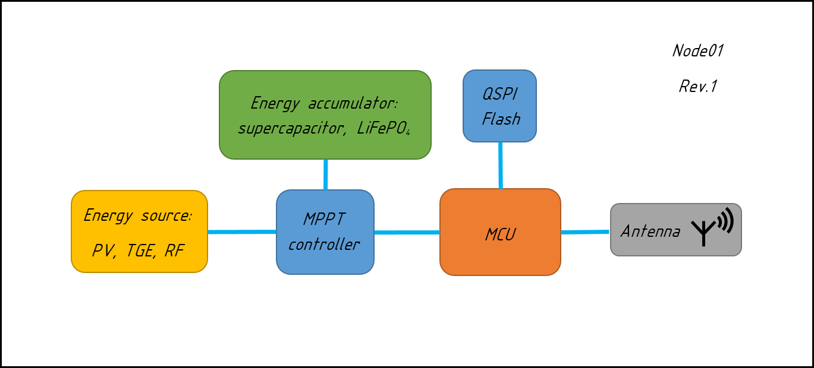

# Project logs
> The purpose of this is to write decisions and changes made to project.

Put:
* current commit hash i.e. at the begining of discussion.
* Date.
* Reporter name.
* Problem description.

---

## Table of contents

1. [Power consumption analysis](#power-consumption-analysis)
1. [MPPT controller](#mppt-controller)
1. [Backup battery](#backup-battery)
1. [Energy sources](#energy-sources)

##### Power consumption analysis.
```
       Number: 1
Project state: 4f51f26244daa80a04ce5664aafaebc53eb92157
         Date: 18/03/2021
     Reporter: Dmitry
      Problem: Too high power consumption, too high energy storage, too high
               PV power.
```
According to current setup,


power consumption analysis showed that worst
scenario daily consumed energy is `10.6 W*h`. Excluding system efficiency out
of calculation. Energy transfer - store - transfer efficiency could be ~80 %.


Which leads to LiFePO4 battery with `3.3 A*h` minimal capacity. Thus, to fully
charge up this battery in most optimistic scenario, 10 hour sunny day, `1.06 W`
PV panel is needed. Or `2.12 W` PV panel in 5 hour sunny day.


```
Solution: Exclude RF frontend. This will lower worst scenario power consumption
          by `345 mW`.
```

##### MPPT controller.
```
       Number: 2
Project state: 83ee388a7370879099274ff98fa68130488713f3
         Date: 18/03/2021
     Reporter: Dmitry
      Problem: Is AEM10941 MPPT controller suitable for current setup?
```
If we assume that there is minimum 5 hour of sun a day then `0.43 W` PV is
needed. If accept that energy converter is 80% efficient, then we need
`0.54 W` PV. According to `AEM10941` [datasheet](../datasheet/DS_AEM10941.pdf)
maximal harvesting power is `550 mW` at `5 V` input voltage.

```
Solution: AEM10941 is suitable for this setup.
```

###### Backup battery.
```
       Number: 3
Project state: bc0d5789db9773c0944a8ec2a8e91152fdf4df60
         Date: 19/03/2021
     Reporter: Dmitry
      Problem: Is backup battery actually required?
```

According to current setup,



High capacity Li-po backup battery is used for periods of time when there is a
lack of harvested energy. This high capacity battery is precharged at install
in to device, and is not being charged during energy harvesting. Because if it
would be charged, then there is no meaning of two batteries, we could simply
increase capacity of rechargable one. Also use of this battery means that there
will be time when this battery should be replaced with charged one in order to
device successfully operates, as it will rely on existance of such backup
battery. So, using this battery means that we should track stored energy in
this battery and replace when it is empty. This leads to additional regular
maintenance of end device. This is in a contradiction with
_minimal maintenance concept_ described in device requirements.
```
Solution: exclude backup Li-po battery from design.
```

###### Energy sources.
```
       Number: 4
Project state: 1ef03a4303f460e012a083986df158970c159b4b
         Date: 19/03/2021
     Reporter: Dmitry
      Problem: What kind of energy sources actually will fit to the design?
```

According to current setup,



Energy sources used are photovoltaics(PV), thermo-electric generator(TEG),
radio-frequency energy(RF). Here we assume low cost, small size device is
desired.

| Energy source |        Pros        |            Cons           |
|:-------------:|:------------------:|:-------------------------:|
| RF            | 24/7 operation     | need nearby source, size  |
| TEG           | 24/7 operation     | good cooling system, size |
| PV            | cheap, scalability | sunlight required,        |

RF energy source will increase size of the device, also it will suffer
from RF energy source. TEG requires good cooling system and so will increase
size of the device. PV will increase size of the device, will operate only when
sunlight exists. Best candidate for this setup is PV as is cheap, easy scalable.
```
Solution: exlude RF, TEG energy sources variant from design. Leave only PV.
```
