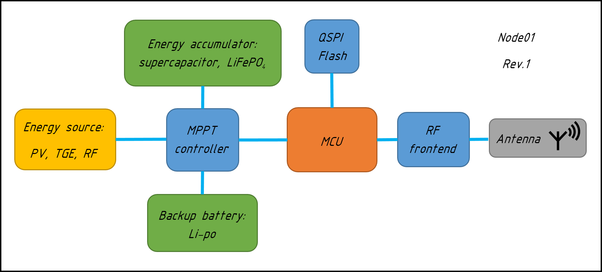
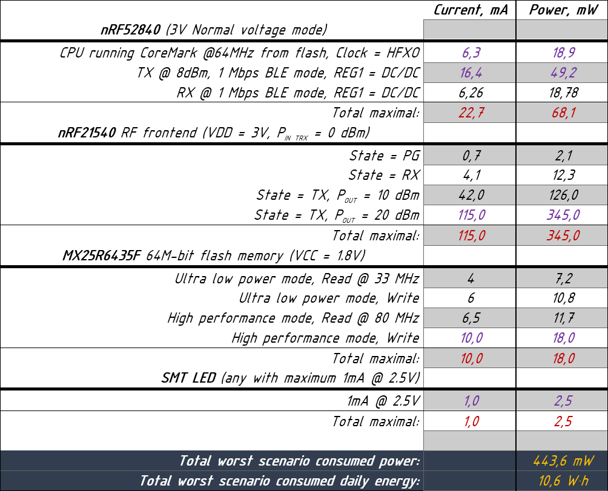
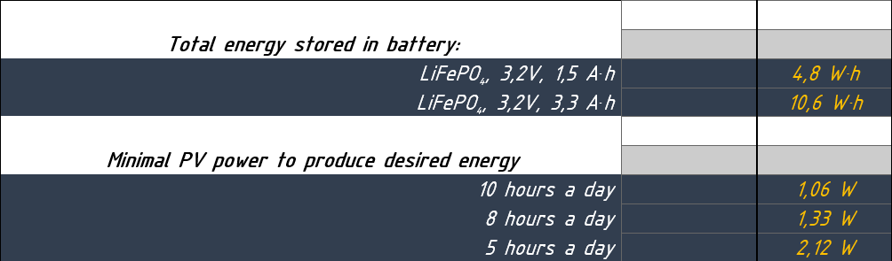

# Project logs
> The purpose of this is to write decisions and changes made to project.  

Put:  
* current commit hash i.e. at the begining of discussion.
* Date.
* Reporter name.  
* Problem description.

---

## Table of contents

1. [Power consumption analysis](#power-consumption-analysis)
1. [MPPT controller](#mppt-controller)

##### Power consumption analysis.  
```
       Number: 1  
Project state: 4f51f26244daa80a04ce5664aafaebc53eb92157  
         Date: 18/03/2021  
     Reporter: Dmitry  
      Problem: Too high power consumption, too high energy storage, too high
               PV power.  
```
According to current setup,

  

power consumption analysis showed that worst
scenario daily consumed energy is `10.6 W*h`. Excluding system efficiency out
of calculation. Energy transfer - store - transfer efficiency could be ~80 %.

  

Which leads to LiFePO4 battery with `3.3 A*h` minimal capacity. Thus, to fully
charge up this battery in most optimistic scenario, 10 hour sunny day, `1.06 W`
PV panel is needed. Or `2.12 W` PV panel in 5 hour sunny day.  

  

```
Solution: Exclude RF frontend. This will lower worst scenario power consumption
          by `345 mW`.
```

##### MPPT controller.
```
       Number: 2
Project state: 83ee388a7370879099274ff98fa68130488713f3 
         Date: 18/03/2021  
     Reporter: Dmitry  
      Problem: Is AEM10941 MPPT controller suitable for current setup?
```
If we assume that there is minimum 5 hour of sun a day then `0.43 W` PV is
needed. If accept that energy converter is 80% efficient, then we need
`0.54 W` PV. According to `AEM10941` [datasheet](../datasheet/DS_AEM10941.pdf)
maximal harvesting power is `550 mW` at `5 V` input voltage.

```
Solution: AEM10941 is suitable for this setup.
```
